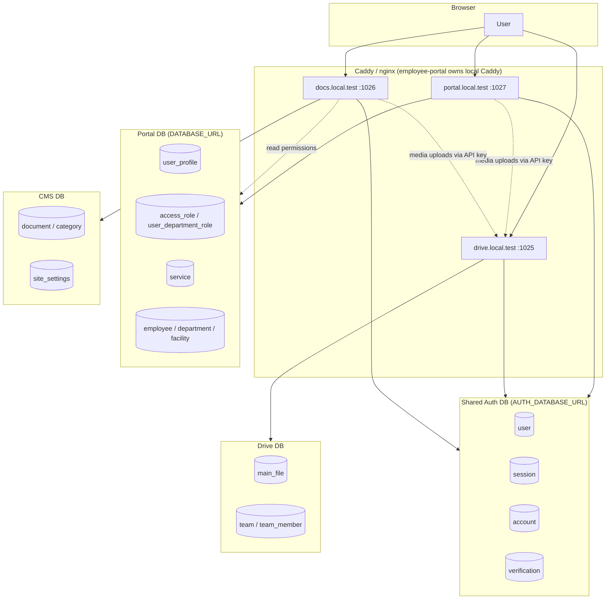
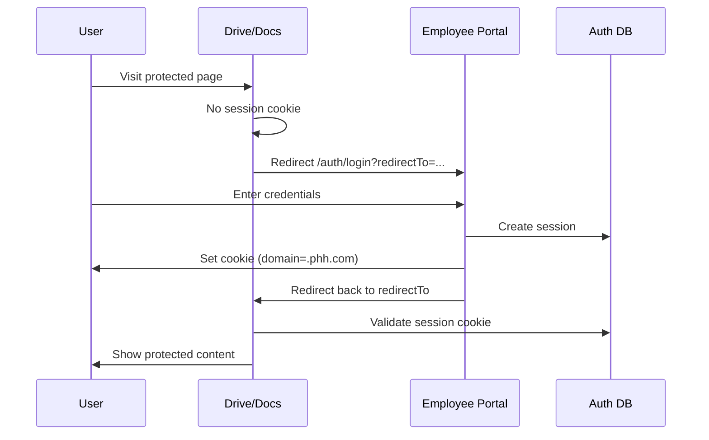
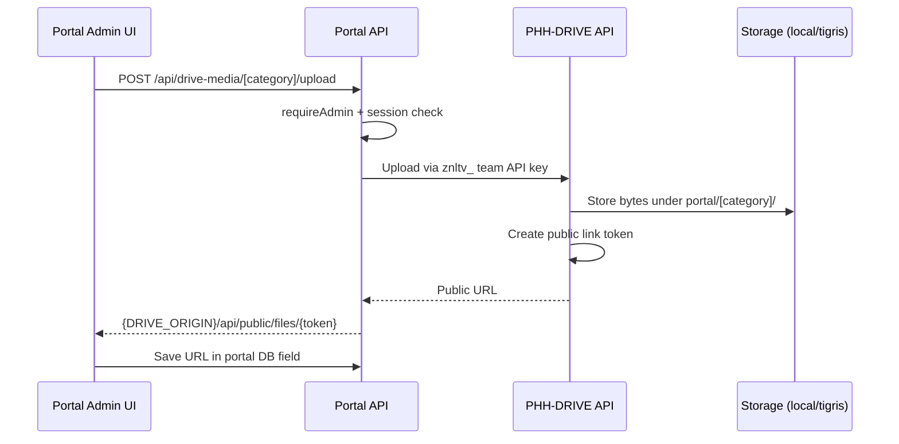

# Employee Portal, PHH-DRIVE & Docs — Architecture, Modules & Test Guide

This document describes the three core PHH applications — **employee-portal**, **drive** (PHH-DRIVE), and **docs** — including their modules, key functions, architecture, integration points, and what you need to write test cases.

---

## Table of Contents

1. [Ecosystem Overview](#1-ecosystem-overview)
2. [Employee Portal](#2-employee-portal)
3. [PHH-DRIVE (drive)](#3-phh-drive-drive)
4. [Docs](#4-docs)
5. [Integration & Links Between Apps](#5-integration--links-between-apps)
6. [Shared Architecture Patterns](#6-shared-architecture-patterns)
7. [Test Case Writing Guide](#7-test-case-writing-guide)
8. [Environment & Local Dev Checklist](#8-environment--local-dev-checklist)
9. [Reference Tables](#9-reference-tables)

---

## 1. Ecosystem Overview

| App | Port (dev) | Role | Primary database |
|-----|------------|------|------------------|
| **employee-portal** | 1027 | Identity provider, org management, service hub | Portal Postgres (`DATABASE_URL`) |
| **drive** (PHH-DRIVE) | 1025 | File storage (personal + team drives) | Drive Postgres (`DATABASE_URL`) |
| **docs** | 1026 | Public documentation CMS + admin | CMS Postgres (`DATABASE_URL`) |

All three share **Better Auth** session cookies via a common auth database and cookie domain.



---

## 2. Employee Portal

**Path:** `employee-portal/`  
**Stack:** SvelteKit 5, Svelte 5 runes, Drizzle ORM, PostgreSQL, Better Auth, Tailwind 4 + daisyUI 5, Paraglide i18n, adapter-node

### 2.1 Modules

| Module | Route prefix | Description |
|--------|--------------|-------------|
| **Onboarding** | `/onboarding` | Home carousel, public app previews |
| **Community** | `/community`, `/community/manage` | Community links (public + admin) |
| **Tips & Tutorials** | `/tips-and-tutorials`, `/tools/guide`, `/tools/learning` | Tool guides and learnings |
| **Services & Apps** | `/services`, `/apps`, `/portal/[id]` | External/internal tool tiles, reverse proxy |
| **Auth** | `/auth/*` | Login, signup, OTP, password reset, invite acceptance |
| **Dashboard** | `/dashboard` | Authenticated home |
| **Employees** | `/employees/*` | Employee CRUD |
| **Departments** | `/departments` | Department management |
| **Facilities** | `/facilities` | Facility management |
| **Users & Invites** | `/users/*` | Portal user management, invites |
| **Roles** | `/roles` | Access role + permission assignment |
| **Settings** | `/settings` | Theme, font, branding, announcements |
| **Tools Admin** | `/tools/manage/*` | Services, apps, guides, learnings CRUD |
| **E-Signature** | `/tools/e-signature` | Built-in signature generator |
| **Notifications** | `/notifications`, `/api/notifications/*` | Notification list + SSE stream |
| **Drive Media** | `/api/drive-media/[category]/*` | Server-side PHH-DRIVE upload proxy |
| **AI Assistant** | `/api/ai-chat` | Rule-based chat endpoint |

### 2.2 Route Groups

| Group | Auth | Layout |
|-------|------|--------|
| `(public)/` | Optional | Navbar layout |
| `(private)/` | Required (+ app access) | Sidebar layout; guests → `/pending` |
| `(public)/auth/` | Guest-only guards | Auth card layout |

### 2.3 Key Server Functions & Services

| File / module | Responsibility |
|---------------|----------------|
| `src/lib/server/auth.ts` | Better Auth config (email/password, OTP, password reset) |
| `src/lib/server/auth-guard.ts` | `requireUser`, `requireAdmin`, `requireAppAccess`, `requireCommunityManage` |
| `src/lib/server/auth-session-config.ts` | Session expiry (7d), rolling refresh (30m), cookie domain |
| `src/lib/server/auth-trusted-origins.ts` | CSRF + post-login redirect allowlist |
| `src/lib/server/safe-redirect.ts` | Safe `redirectTo` resolution for SSO |
| `src/lib/server/permissions.ts` | Role-based nav and CRUD checks |
| `src/lib/server/drive-portal-client.ts` | PHH-DRIVE API client (upload, list, pick, trash) |
| `src/lib/server/drive-media-api.ts` | Drive media category parsing and error handling |
| `src/lib/server/services/builtin-service.ts` | Upsert builtin service tiles from env on startup |
| `src/lib/server/services/service-proxy.ts` | Reverse proxy for embeddable external services |
| `src/hooks.server.ts` | Paraglide locale + Better Auth session → `locals.user` |

**Domain services** (`src/lib/server/services/`):  
`employee`, `department`, `facility`, `portal-user`, `user-invite`, `access-role`, `service`, `app`, `announcement`, `notification`, `notification-sound`, `newsletter`, `tool-guide`, `tool-learning`, `onboarding-slide`, `community-category`, `community-link`, `portal-theme-config`, `portal-font-config`, `ai-assistant`

**Remote functions** (`src/lib/remotes/`): Typed server functions (`query`, `form`, `command`) for client components — 19 modules mirroring domain services.

### 2.4 API Endpoints (REST)

| Resource | Base path | Methods |
|----------|-----------|---------|
| Access roles | `/api/access-roles` | GET, POST; `[id]`: GET, PATCH, DELETE |
| Announcements | `/api/announcements` | GET, POST; `[id]`: GET, PATCH, DELETE |
| Apps | `/api/apps` | GET, POST; `[id]`: GET, PATCH, DELETE |
| Community | `/api/community-categories`, `/api/community-links` | Full CRUD |
| Departments | `/api/departments` | Full CRUD |
| Employees | `/api/employees` | Full CRUD |
| Facilities | `/api/facilities` | Full CRUD |
| Invites | `/api/invites` | GET, POST; `[id]`: POST (resend), DELETE |
| Newsletters | `/api/newsletters` | Full CRUD |
| Notification sounds | `/api/notification-sounds` | Full CRUD |
| Notifications | `/api/notifications` | GET, POST; `[id]`: GET, PATCH, DELETE; `[id]/dismiss`: POST |
| Notification stream | `/api/notifications/stream` | GET (SSE) |
| Onboarding slides | `/api/onboarding-slides` | Full CRUD |
| Services | `/api/services` | Full CRUD |
| Tool guides / learnings | `/api/tool-guides`, `/api/tool-learnings` | Full CRUD |
| Users | `/api/users` | GET, PATCH |
| AI chat | `/api/ai-chat` | POST |
| Better Auth | `/api/auth/*` | All auth operations |
| Drive media | `/api/drive-media/[category]/*` | GET, POST upload, POST pick, DELETE |

**Drive media categories:** `announcements`, `facilities`, `notifications`, `onboarding-slides`, `tool-guides`, `tool-learnings`, `newsletters`, `notification-sounds`, `apps`, `services`, `branding`, `documentation`

### 2.5 Database Schema (Portal)

**Auth tables (shared):** `user`, `session`, `account`, `verification`

**Portal domain tables:**

| Table | Purpose |
|-------|---------|
| `user_profile` | `portal_role` (admin / guest / member) |
| `user_invite` | Admin invite flow |
| `user_department_role` | User ↔ department ↔ access_role ↔ facility |
| `access_role` | Permission flags (nav*, employee*, department*, facility*) |
| `access_role_service` | Role ↔ service M2M |
| `access_role_app` | Role ↔ app M2M |
| `access_role_community_link` | Role ↔ community link M2M |
| `department`, `facility`, `employee` | Org structure |
| `service` | Tool tiles (link, embedMode, isPublic) |
| `app` | Downloadable apps |
| `announcement`, `notification`, `notification_read`, `notification_sound` | Comms |
| `newsletter`, `tool_guide`, `tool_learning` | Content |
| `onboarding_slide`, `onboarding_carousel_config` | Onboarding |
| `community_category`, `community_link` | Community |
| `portal_theme_config`, `portal_font_config` | Branding |
| `support_ticket` | Support |

### 2.6 Existing Tests

| File | Coverage |
|------|----------|
| `src/lib/server/drive-portal-client.spec.ts` | Drive API client |
| `src/lib/server/drive-media-api.spec.ts` | Category parsing |
| `src/lib/constants/drive-media-categories.spec.ts` | Category constants |
| `src/routes/api/drive-media/drive-media.spec.ts` | Drive media route handler |

**Run:** `npm run test:unit` (Vitest), `npm run test:e2e` (Playwright — no e2e files yet)

---

## 3. PHH-DRIVE (drive)

**Path:** `drive/`  
**Stack:** SvelteKit 2, Svelte 5, Drizzle ORM, PostgreSQL, Better Auth, Tigris/local storage, adapter-node

### 3.1 Modules

| Module | Route prefix | Description |
|--------|--------------|-------------|
| **Onboarding** | `/onboarding` | Marketing landing |
| **In-app docs** | `/onboarding/docs/*` | mdsvex user + developer documentation |
| **Auth** | `/auth/*` | Login (SSO redirect to portal); signup disabled |
| **Personal drive** | `/home`, `/home/dashboard`, `/home/recent`, `/home/shared`, `/home/trash` | Personal file management |
| **Team drive** | `/home/team/[id]/*` | Team files, dashboard, shared, trash, settings |
| **Public share** | `/<token>`, `/share/<token>` | Anonymous file preview/download |
| **Developer** | `/api/developer/*` | Developer mode + API key management |

### 3.2 Key Server Functions

| Module | Responsibility |
|--------|----------------|
| `requireApiSession` | Cookie session **or** developer API key (`znldv_` / `znltv_`) |
| `requireCookieApiSession` | Browser-only session (key CRUD) |
| `drive-file-access.ts` | Owner or team membership checks |
| `drive-shared-access.ts` | Email-based share access |
| `team-access.ts` | Team role checks (owner / admin / member) |
| `drive-storage-layout.ts` | Path/key conventions for user vs team trees |
| `drive-seal.ts` | At-rest encryption (`FILE_ENCRYPTION_KEY`) |
| `drive-load.ts`, `drive-move.ts`, `drive-permanent-delete.ts` | File operations |
| `team-manage.ts`, `team-create-root.ts` | Team lifecycle |
| `developer-api-key.ts` | Key generation, hashing, validation |
| `portal-origin.ts` | Portal SSO redirect URL builder |
| `drive-trash-purge.ts` | Cron trash purge |

### 3.3 API Endpoints

| Group | Key paths |
|-------|-----------|
| **Auth** | `POST /api/auth/login`, `logout`, `signup`, `signup/send-otp`, `signup/verify-otp`, `social`, `request-password-reset`, `reset-password`; `GET/POST /api/auth/callback/*` |
| **Teams** | `/api/teams`, `/api/teams/[teamId]`, members, invites, leave, api-keys |
| **Drive** | `/api/drive/files`, `folders`, `upload`, `upload/chunk`, `move`, `reorder`, `batch`, `[id]/download`, `[id]/share`, `[id]/public-link`, `shared`, `trash`, `recent`, `stats` |
| **Developer** | `/api/developer/mode`, `/api/developer/api-keys` |
| **Public** | `GET /api/public/share/[token]`, `GET /api/public/files/[token]` |
| **Cron** | `POST /api/cron/purge-trash` (Bearer `CRON_SECRET`) |

### 3.4 Team API Key Permissions

`drive.read`, `drive.write`, `drive.delete`, `drive.share`, `invites.manage`, `members.*`, `team.settings`, `team.delete`

Key formats:
- User key: `znldv_<prefix>_<secret>`
- Team key: `znltv_<prefix>_<secret>` (scoped to one team)

### 3.5 Database Schema (Drive)

**Auth tables (shared):** same as portal

**App tables:**

| Table | Purpose |
|-------|---------|
| `main_file` | Files/folders (ownerId, teamId, parentId, path, mimeType, storageProvider, trashedAt, etc.) |
| `main_file_share` | Email-based shares |
| `main_file_public_link` | Revocable public tokens |
| `main_file_activity` | Activity log |
| `team` | Team metadata + rootFolderId + storageProvider |
| `team_member` | Membership + role |
| `team_invite` | Email invites |
| `developer_api_key` | User/team API keys |

**Storage providers:** `local` (filesystem) or `tigris` (S3-compatible)

**Portal folder layout on team drive:**

```
portal/
  announcements/
  facilities/
  notifications/
  onboarding-slides/
  tool-guides/
  tool-learnings/
  newsletters/
  notification-sounds/
  apps/
  services/
  branding/
  documentation/    ← used by docs app
```

### 3.6 Existing Tests

**37 unit/spec files** covering API routes, upload (chunk-store, persist, limits), move, seal, trash, portal-origin, require-api-session, team-scope, team-api-key-permission, and component helpers.

**Run:** `npm run test:unit`, `npm run test:e2e` (no e2e files yet)

---

## 4. Docs

**Path:** `docs/`  
**Stack:** SvelteKit 2, Svelte 5, Drizzle ORM, PostgreSQL, Better Auth, CodeMirror, daisyUI 5, adapter-node

### 4.1 Modules

| Module | Route prefix | Auth | Description |
|--------|--------------|------|-------------|
| **Landing** | `/` | Public | Hero, features, category previews |
| **Public docs** | `/docs`, `/docs/category/[slug]`, `/docs/[slug]` | Public | Published documentation viewer |
| **Search** | `/api/search?q=` | Public | Full-text search |
| **Auth** | `/auth/login` | — | Redirects to portal SSO |
| **Admin dashboard** | `/admin` | Docs admin | Stats, document order |
| **Admin documents** | `/admin/documents/*` | Docs admin | CRUD, publish, draft |
| **Admin categories** | `/admin/categories` | Docs admin | Category CRUD |
| **Admin settings** | `/admin/settings` | Docs admin | Site branding, icon, landing config |
| **Drive media** | `/api/drive-media/*` | Docs admin | Upload/pick from PHH-DRIVE |
| **Document media proxy** | `/api/document-media/[slug]` | Public* | Inline PDF proxy |
| **Site icon** | `/site-icon` | Public | Dynamic favicon from DB |

\* Admins can preview unpublished documents via document-media.

### 4.2 Key Server Functions

| Module | Responsibility |
|--------|----------------|
| `src/lib/server/services/docs.ts` | Document CRUD, tree building, search, reorder, publish/draft |
| `src/lib/server/services/categories.ts` | Category CRUD with slug uniqueness |
| `src/lib/server/services/settings.ts` | Site settings single-row config |
| `src/lib/server/auth-guards.ts` | `requireDocsAdmin()`, `assertDocsAdminApi()` |
| `src/lib/server/portal-access.ts` | `canAccessDocsAdmin()` — queries portal DB for RBAC |
| `src/lib/server/drive-portal-client.ts` | PHH-DRIVE client for `portal/documentation/` folder |
| `src/lib/markdown.ts` | Markdown render + HTML sanitization |

### 4.3 Content Types

`markdown`, `html`, `csv`, `pdf`, `video`, `audio`, `image`, `office`

Document hierarchy: categories → root documents → nested children (**max depth 3**).

### 4.4 API Endpoints

| Method | Path | Auth |
|--------|------|------|
| GET | `/api/search?q=` | Public |
| `*` | `/api/auth/[...all]` | Better Auth catch-all |
| POST | `/api/auth/logout` | Session |
| GET | `/api/drive-media` | Docs admin |
| POST | `/api/drive-media/upload` | Docs admin |
| POST | `/api/drive-media/pick` | Docs admin |
| GET | `/api/document-media/[slug]` | Public (admin preview for drafts) |
| DELETE | `/admin/api/documents/[id]` | Docs admin |
| POST | `/admin/api/documents/reorder` | Docs admin |
| GET | `/site-icon` | Public |

### 4.5 Database Schema (Docs)

**Three database connections:**

| DB | Env var | Tables |
|----|---------|--------|
| CMS | `DATABASE_URL` | `category`, `document`, `tag`, `document_tag`, `site_settings` |
| Auth (shared) | `AUTH_DATABASE_URL` | `user`, `session`, `account`, `verification` |
| Portal (read-only) | `PORTAL_DATABASE_URL` | `user_profile`, `service`, `user_department_role`, `access_role_service` |

### 4.6 Docs Admin Access Logic

`canAccessDocsAdmin(userId)` checks (in order):

1. `user_profile.portal_role === 'admin'` → allow
2. Docs service (`DOCS_SERVICE_ID`) has `is_public = true` → allow
3. User has `user_department_role` + `access_role_service` for Docs service → allow
4. Otherwise → deny

### 4.7 Existing Tests

Only placeholder Vitest examples (`greet.spec.ts`, `Welcome.svelte.spec.ts`). **No tests for auth, docs services, API routes, or admin flows.**

---

## 5. Integration & Links Between Apps

### 5.1 Shared SSO (Better Auth)

All three apps must share identical values for:

| Variable | Purpose |
|----------|---------|
| `BETTER_AUTH_SECRET` | Token signing |
| `AUTH_DATABASE_URL` | Shared Postgres auth tables |
| `AUTH_COOKIE_DOMAIN` | Cross-subdomain cookies (e.g. `.local.test`, `.phh.com`) |
| `AUTH_SESSION_EXPIRES_IN` | Default `7d` |
| `AUTH_SESSION_UPDATE_AGE` | Default `30m` |
| `AUTH_SESSION_COOKIE_CACHE_MAX_AGE` | Default `30m` |

**Portal is the identity provider.** Drive and docs redirect unauthenticated users to:

```
{PORTAL_ORIGIN}/auth/login?redirectTo={current-app-url}
```

### 5.2 Builtin Service IDs (Portal)

| Service | Stable UUID | Env var (portal) |
|---------|-------------|------------------|
| PHH-DRIVE | `f47ac10b-58cc-4372-a567-0e02b2c3d479` | `DRIVE_ORIGIN` |
| Docs | `a3b5c7d9-e1f2-4a6b-8c0d-1e2f3a4b5c6d` | `DOCS_ORIGIN` |

On portal startup, `ensureBuiltinServicesOnce()` upserts service tiles from env. Docs access is granted via **Settings → Access roles** (assign Docs service to roles).

### 5.3 Portal → Drive Integration

| Link type | Mechanism |
|-----------|-----------|
| **SSO tile** | `DRIVE_ORIGIN` syncs PHH-DRIVE service link |
| **Post-login redirect** | `DRIVE_ORIGIN` in trusted origins |
| **Admin media uploads** | `DRIVE_TEAM_API_KEY` + `/api/drive-media/*` → drive API |
| **Public file URLs** | `{DRIVE_ORIGIN}/api/public/files/{token}` stored in portal DB |
| **Docker server calls** | `DRIVE_INTERNAL_ORIGIN` when container cannot reach public hostname |

Required portal env for media:

```env
DRIVE_ORIGIN=http://drive.local.test
DRIVE_TEAM_API_KEY=znltv_...   # team key with drive.read, drive.write, drive.share
DRIVE_STORAGE_PROVIDER=local   # or tigris
```

### 5.4 Portal → Docs Integration

| Link type | Mechanism |
|-----------|-----------|
| **SSO tile** | `DOCS_ORIGIN` syncs Docs service link |
| **Navbar link** | `docsHref` from `DOCS_ORIGIN` in public layout |
| **Access control** | Portal `access_role_service` + `DOCS_SERVICE_ID` |
| **Auth** | Docs reads `AUTH_DATABASE_URL` + `PORTAL_DATABASE_URL` |

### 5.5 Docs → Drive Integration

| Link type | Mechanism |
|-----------|-----------|
| **Admin media** | `DRIVE_TEAM_API_KEY` → `portal/documentation/` folder |
| **Endpoints** | `/api/drive-media/upload`, `/api/drive-media/pick`, `/api/drive-media` (list) |
| **Docker** | `DRIVE_INTERNAL_ORIGIN` for server-to-server calls |

### 5.6 Drive → Portal Integration

| Link type | Mechanism |
|-----------|-----------|
| **Login redirect** | `PORTAL_ORIGIN` — unauthenticated → portal login |
| **Signup disabled** | `/auth/signup` redirects to portal |
| **Shared auth DB** | `AUTH_DATABASE_URL` points to portal Postgres |
| **Portal folders** | Team drive `portal/` subfolder for cross-app media |

### 5.7 Integration Flow Diagrams

**SSO login flow:**



**Portal media upload flow:**



---

## 6. Shared Architecture Patterns

| Pattern | All three apps |
|---------|----------------|
| **Framework** | SvelteKit file-based routing, adapter-node |
| **Auth** | Better Auth + `hooks.server.ts` → `locals.user` |
| **ORM** | Drizzle + PostgreSQL (`pg` pool) |
| **i18n** | Paraglide (locale middleware + URL rerouting) |
| **UI** | Tailwind 4 + daisyUI 5 |
| **Validation** | Zod schemas |
| **Testing** | Vitest (unit) + Playwright (e2e scaffold) |
| **Deployment** | Docker, nginx/Caddy reverse proxy |

**Server/client split:**
- `+page.server.ts` / `+layout.server.ts` — auth guards, data loading, form actions
- Svelte 5 components with runes on client
- `src/lib/server/` — never imported on client

---

## 7. Test Case Writing Guide

### 7.1 Test Infrastructure

| App | Unit runner | E2E runner | Unit test location |
|-----|-------------|------------|-------------------|
| employee-portal | Vitest | Playwright | `src/**/*.{test,spec}.{js,ts}` |
| drive | Vitest | Playwright | `src/**/*.{test,spec}.{js,ts}` |
| docs | Vitest | Playwright | `src/**/*.{test,spec}.{js,ts}` |

**Commands:**
```bash
npm run test:unit    # Vitest
npm run test:e2e     # Playwright (build + preview first)
npm run test         # Both
```

### 7.2 Prerequisites for Integration / E2E Tests

| Requirement | Details |
|-------------|---------|
| **Hosts file** | `portal.local.test`, `drive.local.test`, `docs.local.test` → 127.0.0.1 |
| **Caddy** | Run from employee-portal: `npm run caddy:dev` |
| **All three apps running** | Portal :1027, Drive :1025, Docs :1026 |
| **Shared `.env`** | Matching `BETTER_AUTH_SECRET`, `AUTH_COOKIE_DOMAIN`, `AUTH_DATABASE_URL` |
| **Test databases** | Separate Postgres instances or schemas for CI |
| **Drive team API key** | `znltv_...` with read/write/share for media tests |
| **Portal test users** | Admin, member (with Docs service), guest (no access) |

**Setup script (Windows):**
```powershell
cd employee-portal
powershell -ExecutionPolicy Bypass -File scripts/setup-local-sso-hosts.ps1
```

### 7.3 Test Data Requirements

#### Employee Portal

| Entity | Test scenarios |
|--------|----------------|
| `user` + `user_profile` | admin, member, guest roles |
| `access_role` | With/without nav*, employee*, service permissions |
| `user_department_role` | Department + facility + role assignments |
| `service` | Builtin (Drive, Docs) + custom external services |
| `employee`, `department`, `facility` | CRUD, status filters |
| `announcement`, `notification` | Priority, dismiss, SSE stream |
| Drive media categories | Upload, pick, delete per category |

#### PHH-DRIVE

| Entity | Test scenarios |
|--------|----------------|
| `user` (shared auth) | Personal drive owner |
| `team` + `team_member` | owner, admin, member roles |
| `main_file` | Files, folders, trash, move, reorder |
| `main_file_share` | Email share, permission levels |
| `main_file_public_link` | Token access, revocation |
| `developer_api_key` | `znldv_` user keys, `znltv_` team keys |
| Storage providers | `local` and `tigris` paths |
| Chunked upload | Multi-chunk assembly, size limits |

#### Docs

| Entity | Test scenarios |
|--------|----------------|
| `category` | CRUD, slug uniqueness, delete with documents blocked |
| `document` | Draft/published, nesting (max depth 3), content types |
| `site_settings` | Branding, landing config, site icon |
| Portal RBAC | Admin bypass, public service, role assignment, denied |
| Drive media | Upload to `portal/documentation/`, pick existing |
| Search | Published only, query matching |

### 7.4 Test Case Categories by Priority

#### P0 — Critical path (manual + automate first)

| ID | App | Scenario | Expected |
|----|-----|----------|----------|
| TC-SSO-01 | All | Login on portal, open Drive tile | Drive loads authenticated |
| TC-SSO-02 | All | Login on portal, open Docs tile | Docs admin or public docs accessible per role |
| TC-SSO-03 | Drive/Docs | Visit protected page without session | Redirect to portal login with `redirectTo` |
| TC-SSO-04 | All | Logout from one app | Session invalidated (or verify cookie behavior) |
| TC-PORTAL-01 | Portal | Admin creates employee | Employee appears in list |
| TC-PORTAL-02 | Portal | Guest user logs in | Redirected to `/pending` |
| TC-DRIVE-01 | Drive | Upload file to personal drive | File listed, downloadable |
| TC-DRIVE-02 | Drive | Create public link | Anonymous access via `/<token>` |
| TC-DOCS-01 | Docs | Public user views `/docs/[slug]` | Published content renders |
| TC-DOCS-02 | Docs | Non-admin visits `/admin` | Redirect to portal login |

#### P1 — Integration

| ID | App | Scenario | Expected |
|----|-----|----------|----------|
| TC-INT-01 | Portal → Drive | Admin uploads announcement image | URL is `{DRIVE_ORIGIN}/api/public/files/{token}` |
| TC-INT-02 | Docs → Drive | Admin uploads document media | File in `portal/documentation/` |
| TC-INT-03 | Portal | Assign Docs service to role | Member with role can access `/admin` |
| TC-INT-04 | Portal | Remove Docs service from role | Member denied `/admin` (403) |
| TC-INT-05 | Drive | API key `znltv_` scoped to team | Cannot access other team's files |

#### P2 — Edge cases & security

| ID | App | Scenario | Expected |
|----|-----|----------|----------|
| TC-SEC-01 | Portal | `redirectTo` external malicious URL | Blocked by safe-redirect |
| TC-SEC-02 | Portal | Drive media API without admin | 401/403 |
| TC-SEC-03 | Drive | Access file without ownership/share | 403 |
| TC-SEC-04 | Docs | View unpublished doc as non-admin | 404 |
| TC-SEC-05 | Docs | API drive-media without admin | 401/403 |
| TC-SEC-06 | All | Wrong `BETTER_AUTH_SECRET` | Session validation fails |

### 7.5 Unit Test Patterns (from existing code)

**Mock external services:**
```typescript
vi.mock('$lib/server/drive-portal-client', () => ({
  uploadToDrive: vi.fn(),
  listDriveFiles: vi.fn()
}));
```

**Test auth guards:**
- Mock `event.locals.user` with admin / member / null
- Assert redirect status or thrown `redirect()`

**Test API routes:**
- Use SvelteKit `Request` / `Response` or route handler imports
- Mock DB with Drizzle test fixtures or `vi.mock` on pool

**Test portal-access (docs):**
- Mock `portalPool.query` return values for each RBAC branch
- Test `PortalAccessUnavailableError` on DB failure

### 7.6 E2E Test Patterns (recommended)

| Pattern | Tool | Notes |
|---------|------|-------|
| SSO cross-app | Playwright | Use `baseURL: http://portal.local.test` |
| Cookie domain | Playwright | Tests must use `.local.test` hosts, not `localhost` |
| File upload | Playwright | `setInputFiles` on drive/portal upload dialogs |
| Admin flows | Playwright | Login as test admin, navigate sidebar |
| API-only | Vitest + supertest | Faster for CRUD endpoints |

**Suggested Playwright structure:**
```
tests/
  e2e/
    sso/
      portal-to-drive.spec.ts
      portal-to-docs.spec.ts
    portal/
      employees.spec.ts
      roles.spec.ts
    drive/
      upload.spec.ts
      team.spec.ts
    docs/
      public-docs.spec.ts
      admin-documents.spec.ts
```

### 7.7 What to Mock vs. What to Run Real

| Layer | Unit tests | Integration tests | E2E tests |
|-------|------------|-------------------|-----------|
| Auth DB | Mock | Real (test DB) | Real |
| Portal/Drive/Docs DB | Mock | Real (test DB) | Real |
| PHH-DRIVE storage | Mock | Local filesystem | Local or test bucket |
| SMTP | Mock | Mock | Mock |
| Tigris | Mock | Optional test bucket | Optional |
| Caddy/reverse proxy | N/A | Optional | Required for SSO |

### 7.8 Coverage Gaps (current state)

| App | Well tested | Not tested |
|-----|-------------|------------|
| employee-portal | Drive media client, categories | Auth guards, CRUD APIs, permissions, SSO, e2e |
| drive | Upload, move, team scope, API session | SSO redirect, e2e, public share flows |
| docs | Nothing meaningful | Everything except placeholder examples |

---

## 8. Environment & Local Dev Checklist

### 8.1 Minimum env for SSO across all three

**employee-portal `.env`:**
```env
ORIGIN=http://portal.local.test
DRIVE_ORIGIN=http://drive.local.test
DOCS_ORIGIN=http://docs.local.test
AUTH_COOKIE_DOMAIN=.local.test
DATABASE_URL=postgresql://...
AUTH_DATABASE_URL=postgresql://...   # same or shared auth schema
BETTER_AUTH_SECRET=<shared-secret>
DRIVE_TEAM_API_KEY=znltv_...
CADDY_DOCS_UPSTREAM=localhost:1026
CADDY_DRIVE_UPSTREAM=localhost:1025
CADDY_PORTAL_UPSTREAM=localhost:1027
```

**drive `.env`:**
```env
ORIGIN=http://drive.local.test
PORTAL_ORIGIN=http://portal.local.test
AUTH_COOKIE_DOMAIN=.local.test
AUTH_DATABASE_URL=postgresql://...
BETTER_AUTH_SECRET=<shared-secret>
```

**docs `.env`:**
```env
ORIGIN=http://docs.local.test
PORTAL_ORIGIN=http://portal.local.test
AUTH_COOKIE_DOMAIN=.local.test
DATABASE_URL=postgresql://...        # CMS DB
AUTH_DATABASE_URL=postgresql://...   # shared auth
PORTAL_DATABASE_URL=postgresql://... # portal DB for RBAC
BETTER_AUTH_SECRET=<shared-secret>
DRIVE_TEAM_API_KEY=znltv_...
DRIVE_ORIGIN=http://drive.local.test
```

### 8.2 Start order

```bash
# Terminal 1
cd employee-portal && npm run dev

# Terminal 2
cd drive && npm run dev

# Terminal 3
cd docs && npm run dev

# Terminal 4
cd employee-portal && npm run caddy:dev
```

Browse via `http://portal.local.test`, `http://drive.local.test`, `http://docs.local.test` — **not** raw localhost ports (cookie domain and trusted origins depend on this).

---

## 9. Reference Tables

### 9.1 Port & URL Reference

| App | Dev port | Local URL | Production example |
|-----|----------|-----------|-------------------|
| employee-portal | 1027 | `http://portal.local.test` | `https://phh.com` |
| drive | 1025 | `http://drive.local.test` | `https://drive.phh.com` |
| docs | 1026 | `http://docs.local.test` | `https://docs.phh.com` |

### 9.2 Related Documentation

| Document | Path |
|----------|------|
| Shared SSO setup | `employee-portal/docs/shared-auth-sso.md` |
| Portal drive media | `employee-portal/docs/drive-media-integration.md` |
| Drive in-app API docs | `drive` → `/onboarding/docs/developer/rest-api` |
| Docs deployment | `docs/docs/DEPLOYMENT.md` |
| Docker UAT notes | `67-docker/uat/employee-portal-docker-uat.md`, `drive-docker-uat.md`, `docs-docker-uat.md` |

### 9.3 Key Permission Checks Summary

| Check | App | Function |
|-------|-----|----------|
| Logged in | Portal private routes | `requireUser` |
| Portal admin | Portal admin pages | `requireAdmin` |
| Service access | Portal `/portal/[id]` | `requireAppAccess` |
| Drive file access | Drive API | `drive-file-access` + team membership |
| Team API scope | Drive API with key | `team-api-key-permission` |
| Docs admin | Docs `/admin/*` | `canAccessDocsAdmin` → portal DB |
| Drive media upload | Portal `/api/drive-media/*` | Admin + session |
| Drive media upload | Docs `/api/drive-media/*` | Docs admin + session |

---

*Generated from codebase analysis of `employee-portal`, `drive`, and `docs` repositories.*
